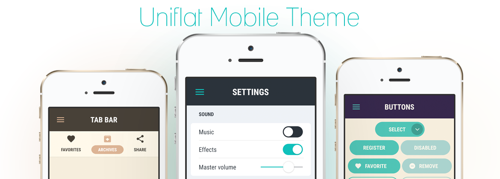

## Uniflat theme for Feathers

Clean, flat mobile theme for [Feathers](https://feathersui.com/).

### Requirements

* Feathers 3.4+
* Starling 2.4+

### Links

* [Sketch template (commercial)](https://gumroad.com/l/sketchforuniflat) by [llorenzo](https://github.com/llorenzo)
* [Live color preview](https://feathers.marpies.com/themes/uniflat/preview/)
* [Setup guide](https://feathers.marpies.com/themes/uniflat/guide/)

### Credits

Created by [Marcel Piestansky](https://marpies.com). Uses [Material Design icons](https://github.com/google/material-design-icons) created by Google and the font [Roboto Condensed](https://fonts.google.com/specimen/Roboto+Condensed) created by Christian Robertson.